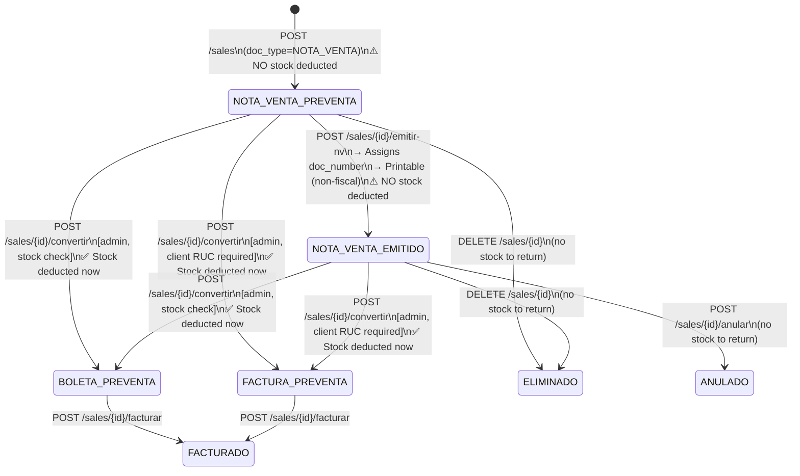
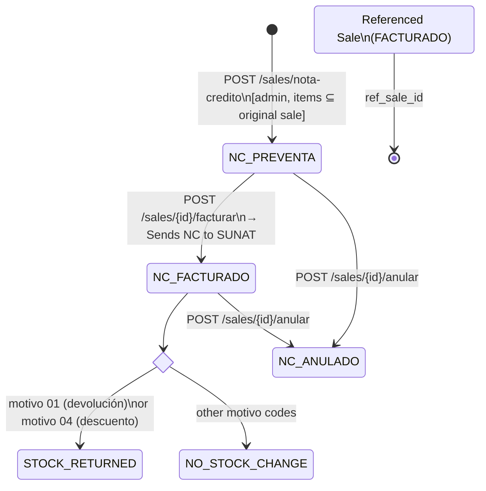
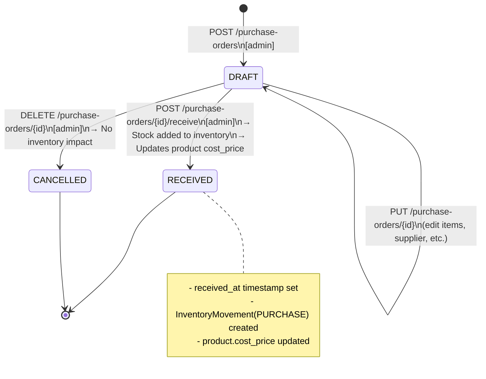
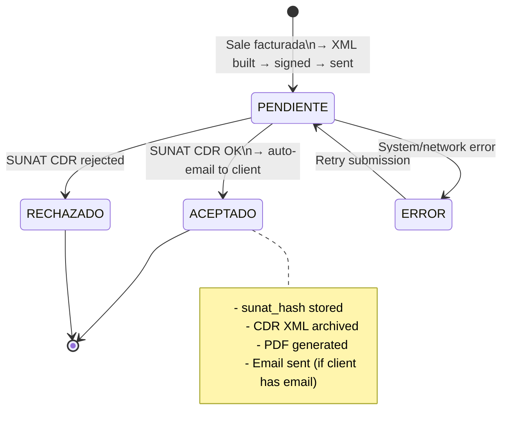
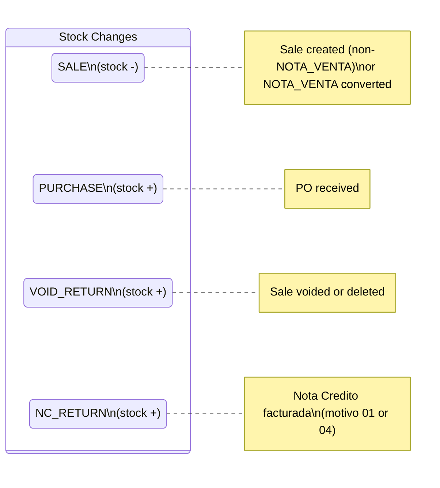
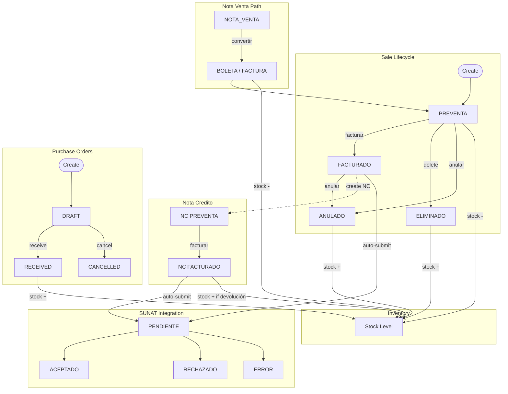

# KTI-POS State Machines

## 1. Sale (Venta) Lifecycle

```mermaid
stateDiagram-v2
    [*] --> PREVENTA: POST /sales

    state PREVENTA {
        note right of PREVENTA
            Actions available:
            - Edit (admin)
            - Print
        end note
    }

    PREVENTA --> PREVENTA: PUT /sales/{id}\n(edit items, client, etc.)
    PREVENTA --> FACTURADO: POST /sales/{id}/facturar\n[admin, RUC if FACTURA]
    PREVENTA --> ELIMINADO: DELETE /sales/{id}\n[admin] → returns stock
    PREVENTA --> ANULADO: POST /sales/{id}/anular\n[admin] → returns stock

    FACTURADO --> ANULADO: POST /sales/{id}/anular\n[admin] → returns stock

    ELIMINADO --> [*]
    ANULADO --> [*]

    note right of FACTURADO
        - SUNAT submission triggered
        - issue_date set
        - Can create Nota de Credito
    end note

    note right of ANULADO
        - voided_by, voided_at recorded
        - Stock returned (if not NOTA_VENTA)
    end note

    note right of ELIMINADO
        - Soft delete (stays in DB)
        - Stock returned (if not NOTA_VENTA)
    end note
```

## 2. Nota de Venta → Emitir / Convertir Flow



## 3. Nota de Credito (Credit Note) Flow



## 4. Purchase Order (Orden de Compra) Lifecycle



## 5. SUNAT Document Lifecycle



## 6. Inventory Movement Types (Audit Trail)



## 7. Complete System Overview



## Action Permissions Matrix

| Action | Endpoint | Role | Valid From States |
|--------|----------|------|-------------------|
| Create Sale | `POST /sales` | any auth | — |
| Edit Sale | `PUT /sales/{id}` | admin | PREVENTA, EMITIDO |
| Facturar | `POST /sales/{id}/facturar` | admin | PREVENTA |
| Emitir NV | `POST /sales/{id}/emitir-nv` | any auth | PREVENTA (NOTA_VENTA only) |
| Anular | `POST /sales/{id}/anular` | admin | PREVENTA, EMITIDO, FACTURADO |
| Delete Sale | `DELETE /sales/{id}` | admin | PREVENTA, EMITIDO |
| Convertir NV | `POST /sales/{id}/convertir` | admin | PREVENTA, EMITIDO (NOTA_VENTA only) |
| Create NC | `POST /sales/nota-credito` | admin | ref sale = FACTURADO |
| Create PO | `POST /purchase-orders` | admin | — |
| Edit PO | `PUT /purchase-orders/{id}` | admin | DRAFT |
| Receive PO | `POST /purchase-orders/{id}/receive` | admin | DRAFT |
| Cancel PO | `DELETE /purchase-orders/{id}` | admin | DRAFT |
